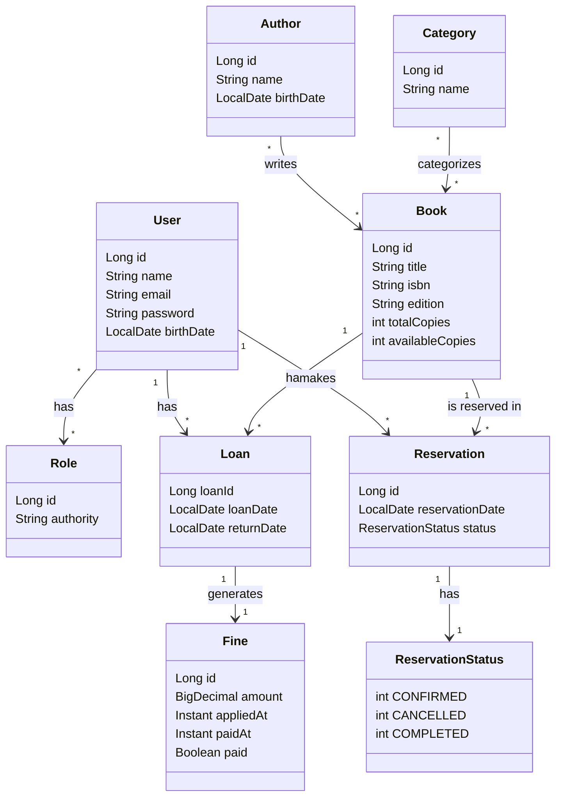

# LibraryManager 📚


https://librarymanager-96yy.onrender.com/swagger-ui.html


## 📌 Project Context & Objectives

This repository serves as a **technical showcase** based on an existing project ("LibraryManager"). The primary goal of this iteration is to demonstrate adherence to **software engineering best practices**, specifically focusing on:

* **Clean Architecture** principles.
* **Git Workflow:** Atomic commits, semantic versioning, and clean issue management.
* **Refactoring:** Code optimizations and dependency updates.

> **⚠️ Infrastructure Note:**
> This application was previously deployed and active on **Render**. However, due to the expiration of the platform's free tier services, the live demo is currently unavailable. The codebase remains fully functional for local deployment via Docker or Maven.
>
> 
# Overview
LibraryManager is a Spring Boot application designed to efficiently manage library operations. It allows users to manage books, authors, loans, and users, ensuring smooth management of library resources. The system includes OAuth2 authentication, book tracking, loan and reservation management, and fine tracking. It uses PostgreSQL as the database and comes with API documentation via Swagger.

This project is also dockerized for easy deployment and is hosted on Render, which provides a CI/CD pipeline, ensuring that updates are automatically deployed when code changes.

# Technologies
- Java
- Spring Boot
- OAuth2 
- Swagger
- H2 Database
- Postgres Database
- JPA / Hibernate
- Maven
- Docker
- CI/CD
  
# Features
- 📚 Manage books, authors, and categories  
- 📝 Track loans, returns, and fines  
- 👤 User registration and authentication  
- 📅 Book reservation system with status management via Scheduler   
- 📖 API documentation via **Swagger UI**  
- 🐘 PostgreSQL database integration  
- 🐳 Dockerized for local and production deployment  
- ⚡ Hosted on **Render** with **CI/CD** 

# How to run the project
 Requires Java 21
```bash
# clone repository
git clone https://github.com/filipemirandam95/LibraryManager.git
# acess the back-end folder
cd backend

# runs the project
./mvnw spring-boot:run
```

# Domain Class Diagram


# Author
Filipe Miranda Maduro
https://www.linkedin.com/in/filipemirandamaduro/
